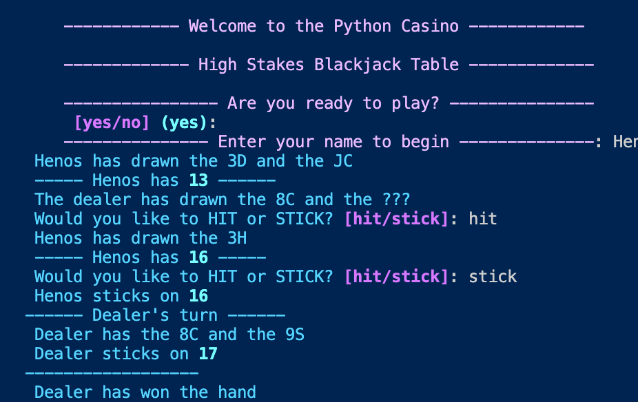

# BlackJack

  
  

The application is a command-line BlackJack game where the player will compete 1v1 against the dealer for the hand.
The objective of the game is to have a hand of cards that's point value is as close to 21 as possible whilst being
no larger than 21.
